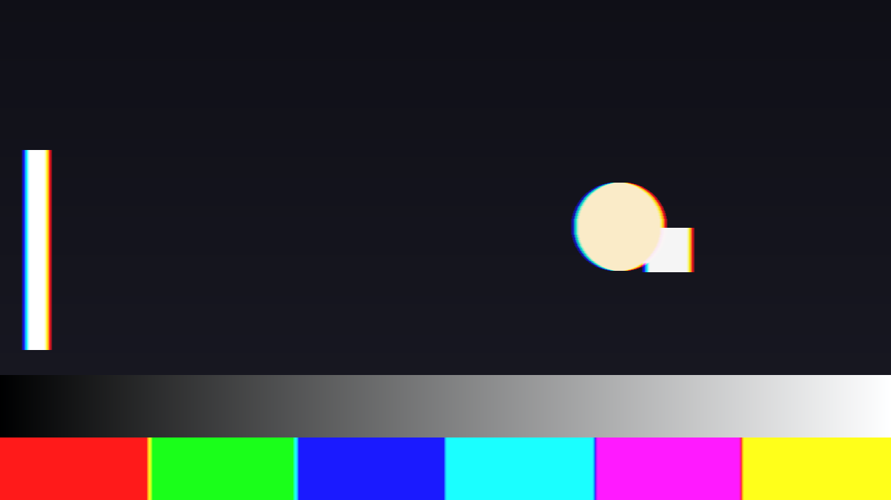
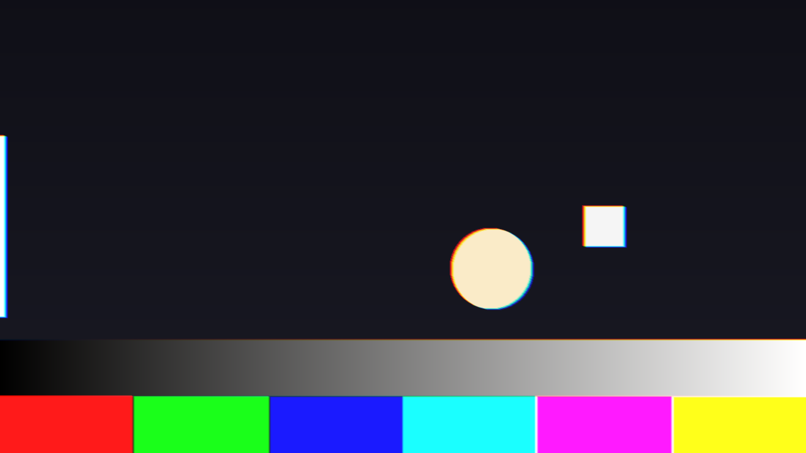
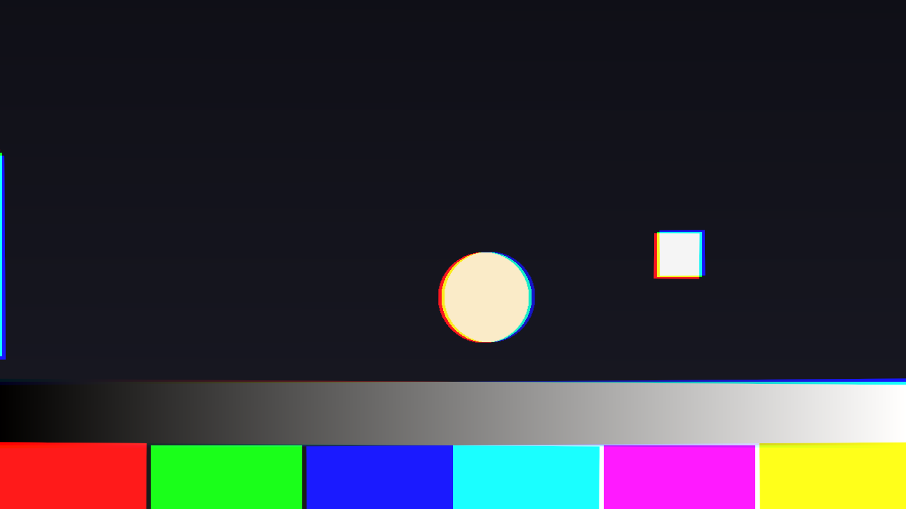

# Wheel user guide

Wheel is **a single-chip DLP projector for [Resolume](https://resolume.com) Arena and Avenue**, as
an FFGL effect. It does not paint colour fringes onto a clip. It shows the clip the way a
single-chip DLP does — a red picture, then a green one, then a blue one, through a spinning
filter wheel — and then adds those pictures back up the way an eye does. A still eye adds them
up perfectly. A moving eye lands each colour somewhere else, and that is the rainbow effect.



*A pursuit of 12 px a frame to the right on a 1x RGB wheel, over the repo's test card. Red leads
and blue trails on every bright edge, because red was shown first and the eye had moved on by
the time blue arrived. The colour bars fringe too: it is not an edge effect, it is where each
field landed. Rendered by the offline harness, not captured from Resolume.*

> **Before you rely on this:** released at **v0.1.0**, and honestly early. The model is measured
> rather than asserted, by a harness that drives the real plugin class: a still eye returns the
> input with **0 bytes different** at all five wheel speeds on a moving clip; a pursuit of 6 px a
> frame on a 1x wheel lands red and green **2.0000 px** apart against 2.0000 predicted, and red is
> green shifted by exactly two pixels, bit for bit; a 2x wheel halves that to 1.0000; light is
> conserved under motion to within 3.2e-4; a saccade's fringe decays by e⁻¹ over Saccade Time
> to within 0.0003; and all 23 controls the sweep can reach measurably change the picture. It has **never
> been loaded into Resolume on macOS** — the one host it has run in is the fleet's own test host,
> `oxbow`, which reads its name, id and type.
> On Windows, a build of v0.1.0 loads, registers and renders in Resolume Arena 7.27.1, with every control matching what the plugin declares — on software rendering, so that says nothing about a GPU. Two controls that only act during a saccade, Saccade Size and Saccade Time, could not be shown moving there, because nothing fired a saccade.
> Try it on a spare layer before you put it in a show.
>
> This codebase was created with AI assistance, directed and reviewed by a human author.

---

## Installing

Every download carries one effect, **SW Wheel**. Drop it into Resolume's effects folder and
restart Resolume:

```
macOS    ~/Documents/Resolume Arena/Extra Effects/
Windows  %USERPROFILE%\Documents\Resolume Arena\Extra Effects\
```

Avenue uses the same layout under its own folder name. The effect then appears in the effects
browser as **SW Wheel**.

The macOS download is a universal build (Apple silicon and Intel), as a `.dmg` or a `.zip`: open
it and drag `Wheel.bundle` into the folder above. It is **Developer ID-signed and notarised**,
so the bundle simply loads. The Windows download is an x64 installer or a
`.zip`. The installer asks where to put the plugin — point it at the folder above. It is not
code-signed, so it trips SmartScreen once: **More info** → **Run anyway**.

---

## The fringe is in the eye, not the projector

Drop SW Wheel on a layer and **nothing happens**. That is not a fault; it is the plugin working.

A real single-chip DLP holds each frame on its mirror chip for the whole frame, and shows it
through each filter of the wheel in turn. If your eye is still, every colour lands in the same
place and you see the picture — however fast the clip moves, and whatever the wheel. The
plugin reproduces that exactly: with **Eye Mode = Still** the output is the input, to the last
bit, on any wheel at any speed.

The rainbow appears only when **the eye** moves relative to the screen — following something
across it, or darting from one place to another. So the most important control here is not a
projector control at all. It is **Eye Mode**, and it decides what your imaginary viewer's eye is
doing.

This is not a chromatic-aberration effect. A lens fringe is fixed to the picture; this one comes
and goes with the eye, changes with the wheel, and shows on flat colour as well as edges. The one
fixed fringe the plugin does have is **Three Chip** mode, which is a different projector
altogether (see below).

---

## Start here

Put SW Wheel on a layer with something bright and high-contrast in it — white text, a logo,
hard edges. The defaults are an **RGB wheel at 2x, with a still eye**, which shows nothing. Then,
in this order:

1. **Eye Mode → Pursuit.** The eye now moves at a steady 8 px a frame to the right, and every
   bright edge splits into red, green and blue. This is what someone following a moving object
   across a DLP screen sees.
2. **Pursuit Speed.** Up for a wider fringe. **Pursuit Angle** turns the direction.
3. **Wheel Speed.** Down to **1x** for the widest fringe; up to **6x** and it packs tight.
   That is the whole reason real projectors spin their wheels faster.
4. **Wheel Type → RGBW.** Whites and greys get brighter and saturated colours do not — the
   white segment's signature.
5. **Eye Mode → Saccade**, with an audio track feeding the layer. Each hit now throws the eye,
   and a rainbow flashes across the bright parts of the picture and dies away. **Fire** does the
   same by hand, in any Eye Mode.

The width of the fringe is easy to work out. On an RGB or RGBCMY wheel at 1x, red and green land
**a third of the Pursuit Speed apart** — 12 px a frame puts them 4 px apart, and blue the same
again past green (on RGBW it is a quarter) — and a faster wheel divides that by its speed.
Pursuit Speed is in **pixels per frame of your composition**, so the same setting is a faster eye, in pixels per second, at 60 fps than at 30.

---

## The Wheel group

**Wheel Type** — the filter segments, in the order they pass:

| Type | Segments |
| --- | --- |
| **RGB** | Red, green, blue, a third of a turn each. The default. |
| **RGBW** | Red, green, blue and white, a quarter each. |
| **RGBCMY** | Six equal segments in the alternating order red, yellow, green, cyan, blue, magenta, so a primary is never next to a primary. |
| **Custom** | Red, green, blue and white, sized by the four width sliders below. |

**Wheel Speed** — **1x, 2x, 3x, 4x or 6x**: how many times the wheel turns in one frame of your
composition. Each segment comes round that many times per frame, so the colours are shown closer
together in time and the fringe shrinks in proportion — 2x is exactly half of 1x. Default **2x**.

**Red Width, Green Width, Blue Width, White Width** — **Custom only**; on the other types they do
nothing. How much of the turn each segment takes. They are shares, not absolute sizes: the four
are added up and each is divided by the total, so all four at 0.25 is the same wheel as all four
at 1. A colour slider at zero still leaves a sliver of that colour's segment (a wheel with no red
segment could not show red at all), but **White Width at zero removes the white segment**.
With a still eye the three colour widths make no difference to the picture at all — the colours are balanced so a still eye
always sees the input — and only move where the fields land once the eye moves. White Width does
show on a still eye: it is how much the white segment brightens.

**White Gain** — how bright the white segment, and on RGBCMY the yellow, cyan and magenta ones,
are against the red, green and blue ones. 0 to 1, default **0.5**. It only does anything on a
wheel that has such a segment: RGBW, RGBCMY, or Custom with some White Width.

A white segment shows **the part of each pixel that all three colours share** — the least of its
red, green and blue — so it brightens whites and greys and leaves a fully saturated colour
exactly where it was. Measured at Output Gamma 1.0: on RGBW, a grey of 64 becomes **128** at White
Gain 1 and **96** at 0.5, while a pure red stays at 255 with no green in it. At the default gamma
of 2.2 the light is added in linear light, so the same grey comes out nearer 88 at White Gain 1
(by arithmetic, not measured). A yellow segment shows the part red and
green share, and so on round the wheel.

**A bright white can go past full white**, and the output clips it. That is what a real RGBW
wheel does to whites against colours; turn White Gain down if it bothers you.

---

## The Eye group

**Eye Mode** — what the viewer's eye is doing:

- **Still** — nothing. No fringe, whatever else is set. The projector working as intended.
- **Pursuit** — the eye moves at a steady speed and direction, set by the two sliders below.
  Everything on screen fringes, not only what moves, because it is the eye that moved.
- **Track** — the eye follows the clip's own motion. The plugin measures where most of the
  picture is going each frame and moves the eye with it, so a pan fringes and a static shot does
  not. It follows **the picture as a whole**, not any one object: on a shot where a small thing
  moves over a still background, the eye stays with the background. It eases halfway towards
  each new measurement every frame, so it takes a couple of frames to catch up with a new
  movement. It can follow up to three thirty-seconds of the picture's width per frame sideways
  (180 px at 1920 wide) and three eighteenths of its height up and down; faster motion than that
  is not seen.
- **Saccade** — still, until the audio has a hit. Each hit throws the eye a set distance in a
  random direction, and the fringe dies away as the eye settles.

**Pursuit Speed** — how fast the eye moves in Pursuit, **0 to 32 px per frame**. Default **8**.

**Pursuit Angle** — which way. The slider goes once round the circle: **0 is rightwards**, a
quarter of the way along is **straight down**, halfway is leftwards, three quarters is up. Red
leads in the direction of travel and blue trails.

**Saccade Size** — how far one saccade throws the eye, **0 to 200 px** in total. Default **40**.

**Saccade Time** — how quickly a saccade settles, from **20 ms to 1 s**. The slider is geometric,
so its middle is about 0.14 s. Default **0.1 s**. It is a time constant: after one Saccade Time
about a third of the fringe is left, after two about a seventh. It is in seconds, not frames, so
it looks the same at any frame rate.

**Fire** — a button: one saccade, now, **in any Eye Mode**. In Pursuit it adds on top of the
pursuit. A new saccade replaces one still in flight rather than adding to it. Each saccade goes
in a new direction, and the sequence of directions is the same every time.

**Audio** — Resolume fills this with the layer's audio spectrum; it is not a slider. It only
fires saccades **in Saccade mode**, so switching to Pursuit or Track never gets you a surprise one.
It listens for any sudden rise across the spectrum, against a level that follows the recent
activity, so a run of hits raises the bar and a quiet passage lowers it. Two hits closer than
80 ms count as one. The first frame of audio the effect hears — when it loads, or after the clock
jumps — is taken as the starting point, not as a hit, so that frame never throws a saccade.



*A saccade in flight on the test card: the disc, the square and the bar all split along the
direction the eye was thrown. Rendered by the offline harness.*

---

## The DMD group

A DMD's mirrors are either on or off. It makes a grey by flicking each mirror on for a
binary-weighted share of the time — one plane for each bit of the grey — and the eye averages
them. Move the eye and the planes of a single grey land in different places, so a smooth ramp can
break into bands that are not in the picture. This is off by default.

**Bit Planes** — on or off.

**Bit Depth** — **1 to 8** bit planes, default **6**. Only matters with Bit Planes on.

The levels are cut **in linear light**. At Output Gamma 1.0 and with a still eye, 8 planes give
back the input exactly and 4 planes are the picture cut to 16 levels a channel. At the default
gamma of 2.2 the banding crowds into the shadows — even 8 planes crush the very deepest ones —
which is where a real DMD shows it too. Under motion the planes come apart. The least significant
plane is shown first; a real DMD also splits its biggest planes into several slices, and this
does not.

---

## The Three-Chip group

**Chip Mode** — **Single Chip** or **Three Chip**.

A three-chip projector has no wheel. It has a separate panel for red, green and blue, all shown
at once, so a moving eye sees **no colour breakup at all** — the Wheel group does nothing in
this mode, and Pursuit only blurs. What a three-chip projector gets wrong instead is
**convergence**: the three panels are never perfectly lined up, and the colours sit slightly
apart all the time, still eye or not.

**Red dx, Red dy, Blue dx, Blue dy** — how far the red and blue panels are off, against green,
**±8 px**, with the middle of the slider exactly none. Only in Three Chip mode. Above the middle,
**dx moves that colour's picture left and dy moves it up**; below the middle, right and down.

**Panel Rotate** — twists the red panel one way and the blue the other about the centre of the
picture, **±1°**, middle exactly none. Only in Three Chip mode.

Bit Planes still apply in Three Chip mode.



*Three Chip, red and blue a few pixels off and slightly rotated against green. Rendered by the
offline harness.*

---

## The Output group

**Mix** — the processed picture against the untouched clip. Zero is the clip as it arrived.
Default **1**.

**Output Gamma** — **1.0 to 3.0**, default **2.2**. The plugin turns the clip into linear light
on the way in, adds the colour fields up there, and turns it back on the way out with this
gamma. It is what makes a fringe of red and green look like a real one: light adds in linear
light, not in the picture's encoded values. With a still eye on an RGB wheel it changes nothing;
it does change how much a white segment brightens, and where Bit Planes band. **1.0** treats the
clip as already linear.

The clip's alpha travels with the colour fields, so under motion an alpha edge moves and softens
with the picture.

---

## How it works

Once a frame, for every pixel:

1. **The wheel becomes a timetable.** Each segment's pass is a slice of the frame — on an RGB
   wheel at 1x, red for the first third, green for the second, blue for the last. At 2x, each
   twice, half as long.
2. **The eye becomes a path.** Pursuit is a straight line; a saccade is a jump that slows as it
   lands; Track is the picture's own measured motion. Each slice of the frame is where the eye
   was during it.
3. **Each slice is looked up where the eye was**, through that segment's filter, and smeared
   along the eye's path for as long as the slice lasted — the retina integrating.
4. **The slices are added up** in linear light. The red, green and blue slices are balanced so a
   still eye gets back exactly what went in; white and secondary segments add on top, at White
   Gain.

Nothing is drawn. The frame is held for its whole period and never blended with the next,
because a DMD does not do that either — which is why a still eye sees no fringe on even the
fastest clip. Where the eye is looking decides everything.

The wheel's position restarts every frame (it turns a whole number of times per frame), and a
saccade is worked out a frame at a time, so nothing depends on how long Resolume has been
running.

---

## Performance

Measured by the offline harness on an M4 Max, in milliseconds per frame, with other work running
on the machine — treat these as upper bounds:

| | defaults (RGB 2x, still eye) | Pursuit on RGBCMY at 6x (the heaviest) | Track eye |
| --- | --- | --- | --- |
| 1280×720 | 0.45 | 2.27 | 1.08 |
| 1920×1080 | 0.90 | 5.45 | 1.72 |
| 2560×1440 | 1.66 | 9.61 | 2.65 |
| 3840×2160 | 3.29 | **19.1** | 5.19 |

**The cost is the wheel times the eye.** A still eye costs one sample per colour slice; a moving
eye up to nine; and RGBCMY at 6x is 36 slices. At 4K under pursuit that is more than a 60 fps
frame. If you need 4K, use RGB or RGBW and a lower Wheel Speed. Track adds a small read-back from
the GPU every frame. The plugin keeps one picture-sized half-float copy of the clip, with
its mip levels — about 22 MB at 1080p and 88 MB at 4K, by arithmetic rather than measurement.
Nothing was timed inside Resolume, and nothing was timed on Windows.

---

## If it looks wrong

**Nothing happens.** Eye Mode is on Still. That is the plugin being right; see the start of this
guide. Set it to Pursuit. If it still does nothing, check Mix is not at zero.

**A Wheel slider does nothing.** The width sliders only act on a Custom wheel, and White Gain only
on a wheel with a white or secondary segment. In Three Chip mode the whole Wheel group is out of
the picture. With a still eye, the colour widths and Wheel Speed show nothing either, by design.

**The Three-Chip sliders do nothing.** Chip Mode is on Single Chip.

**Saccade mode never fires.** The layer has no audio, or nothing in it rises sharply enough. Press
Fire to check the rest works. Remember the audio only fires saccades in Saccade mode.

**Track does nothing, or follows the wrong thing.** Track follows the picture as a whole; on a
static shot with a small moving object it correctly stays still. Very fast motion — more than
about a tenth of the picture's width, or a sixth of its height, per frame — is beyond what it
searches.

**Whites are blown out.** A white or secondary segment is pushing them past full white. Lower
White Gain.

**The shadows band.** Bit Planes is on with a low Bit Depth.

**It is slow.** RGBCMY at 6x under a moving eye is the heaviest setting there is. See Performance.

**SW Wheel is not in the effects browser.** Check the folder under Installing, and that Resolume
was restarted.

**The effect does nothing at all**, not even with Eye Mode on Pursuit. A shader that will not
compile looks exactly like that, and the real message is in the log:

```
macOS    ~/Library/Logs/wheel/wheel.YYYY-MM-DD.log
Windows  %LOCALAPPDATA%\wheel\logs\wheel.YYYY-MM-DD.log
```

It records the GL vendor and version at load, which shader failed if one did, a buffer that could
not be allocated, and the unit of the host's clock.

---

## Known limits

- **Never loaded into Resolume on macOS**, and nothing has driven the controls in a host. How
  the six groups read in the inspector, and whether Fire draws as a button, is untested.
- **The eye is a model, not a measurement.** A pursuit is a constant speed; a saccade is a jump
  that slows exponentially, in a direction chosen for it; Track is one global estimate. Real eyes
  accelerate, overshoot and look at one thing while the background does another. Where each
  colour lands for a given eye path is exact; which path a viewer's eye takes is yours to choose.
- **Track follows the whole picture**, measured on a coarse 32 × 18 grid, not the object you
  would look at.
- **The audio has only ever been tested with synthetic spectra.** Nobody has measured what
  Resolume's 64 spectrum bins are; the detector relies only on a hit making some of them rise.
- **A saccade's smear within one colour slice is a straight line** where the real one curves
  slightly. Where each slice lands is right.
- **Bit planes are one slice per bit**, least significant first. Real DMDs split and reorder
  their planes in ways that differ by model.
- **A white segment shows the least of red, green and blue.** Real projectors differ in how they
  split a pixel across a white segment; this is the choice that leaves a saturated colour alone.
- **A host that renders the same frame twice** — a preview and a record, say — moves a saccade on
  twice. Nothing in FFGL tells a plugin that it happened.
- **No presets**, no OpenFX version and no browser demo.

---

## About

The last group, **About**, carries the plugin's name, version, licence and maker, and buttons
that open this user guide, the project page, the source on GitHub and the support page in your
browser.

## Reporting something

[github.com/stoatworks-labs/wheel/issues](https://github.com/stoatworks-labs/wheel/issues).
A screenshot, the Wheel Type, Wheel Speed and Eye Mode, and the composition's resolution and
frame rate is usually enough.
